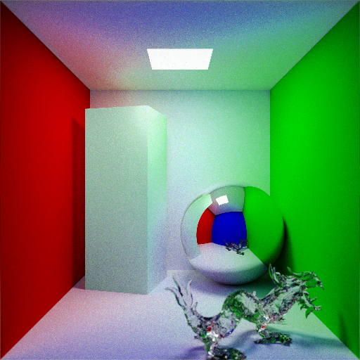

# CPUPathTrace

CPUPathTrace is an unbiased monte carlo path tracer written in C++.



Triangle mesh loading through OBJ files is supported, and a BVH is used to accelerate ray-object intersections.
Importance sampling is used for B*DFs and light sources.

The bundled XYZ RGB dragon model is based on data from the [Stanford Computer Graphics Laboratory](https://graphics.stanford.edu/data/3Dscanrep/3Dscanrep.html) (XYZ RGB model: "Asian Dragon").

## Structure

The project consists of the following separate parts:

* The PathTrace library, with its interface located in `include/` and sources in `src/`
* A demo application in `demo/main.cpp` that uses the library to construct and render a Cornell-box-type scene
* Tests for the library in `test/`
* Fuzzers targeting library functions in `fuzz/`
* Benchmarks for the library in `benchmark/`

The executables produced should be run with the project root directory as their working directory.

## Building

A cmake project is used for building.

**Requirements**:
 * Git (for checkout only)
 * CMake 3.13 or later
 * C++ compiler that (largely) supports C++20, such as Clang 10 or later, GCC 10 or later, or MSVC from VS 2019 16 or later (unsupported)
 * C++ standard library that (largely) supports C++20, such as libstdc++, libc++, or MSVC STL (unsupported)
 * libpng
 * Google Test (for testing only)
 * Google benchmark (for benchmarks only)

Basic build procedure with default compilers and options:
```shell
# Checkout project sources
git clone https://github.com/johannesschaeufele/CPUPathTrace.git
# Prepare build directory
cd CPUPathTrace
mkdir build
cd build
# Configure build
cmake ..
# Build project
cmake --build .
```

Sample commands to build with Clang and LLVM tools using ninja:
```shell
git clone https://github.com/johannesschaeufele/CPUPathTrace.git
cd CPUPathTrace
mkdir build
cd build
cmake -G "Ninja" -DCMAKE_CXX_COMPILER=clang++ -DCMAKE_LINKER=ld.lld -D_CMAKE_TOOLCHAIN_PREFIX=llvm- -DCMAKE_EXE_LINKER_FLAGS="-fuse-ld=lld" ..
ninja
```
